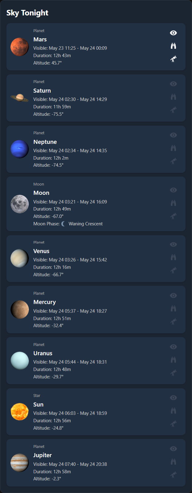

# Sky Tonight Card

[](https://github.com/wwwescape/sky-tonight-card/releases)
[](https://github.com/wwwescape/sky-tonight-card/commits/master)
[](https://github.com/wwwescape/sky-tonight-card)
[](https://github.com/hacs/default)
[](https://codecov.io/gh/wwwescape/sky-tonight-card/)
[](https://www.codefactor.io/repository/github/wwwescape/sky-tonight-card)


#### A Home Assistant card showing sun, moon, and planet visibility using Astronomy Engine



## Installation


### Manual install
1. Navigate to your `<config>/www/` folder inside your Home Assistant installation and create a new folder named `sky-tonight-card`.
2. Manually download [sky-tonight-card.js](https://raw.githubusercontent.com/wwwescape/sky-tonight-card/main/sky-tonight-card.js) and `images` folder.
3. Place them inside the `sky-tonight-card` folder you created in step 1.
4. Add the following to your `configuration.yaml` file:
  ```yaml
  lovelace:
    resources:
      - url: /local/sky-tonight-card/sky-tonight-card.js
        type: module
  ```
5. Alternately, go to `Settings` -> `Dashboards`. Then in the top right corner, click the 3 dots icon and click `Resources`. Click the `+ Add Resource` button in the bottom right corner. Add `/local/sky-tonight-card/sky-tonight-card.js` as the `URL` and choose `JavaScript Module` as the `Resource Type`. Click `Create`.
6. Finally, refresh your browser window.

**Note:** The url path may need to be adjusted to reflect the location of your configuration direction, as seen from the running system.  For example on some HAAS systems it will appear to be `/root/config/www/sky-tonight-card/sky-tonight-card.js`  (i.e /root/config instead).

## Configuration

| Name              | Type          | Default                               | Description                                                                                                                     |
| ----------------- | ------------- | ------------------------------------- | ------------------------------------------------------------------------------------------------------------------------------- |
| type              | string        | **Required**                          | `custom:sky-tonight-card`                                                                                                |
| latitude          | string        | **Required**                          | Latitude of the observer                                                                                                        |
| longitude         | string        | **Required**                          | Longitude of the observer                                                                                                       |
| elevation         | number        |                                       | Elevation of the observer in metres above sea level                                                                             |
| showBelowHorizon  | boolean       | `false`                               | Set to false to display planetary bodies only above the horizon                                                                 |
| showSun           | boolean       | `false`                               | Set to false to hide the Sun                                                                                                    |                                                                                |

## Example configurations

```yaml
type: custom:sky-tonight-card
latitude: 28.627222
longitude: -80.620833
```